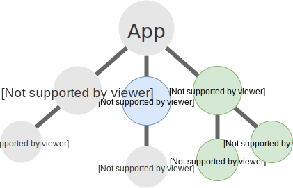
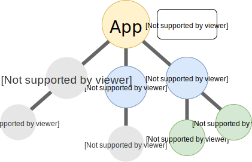
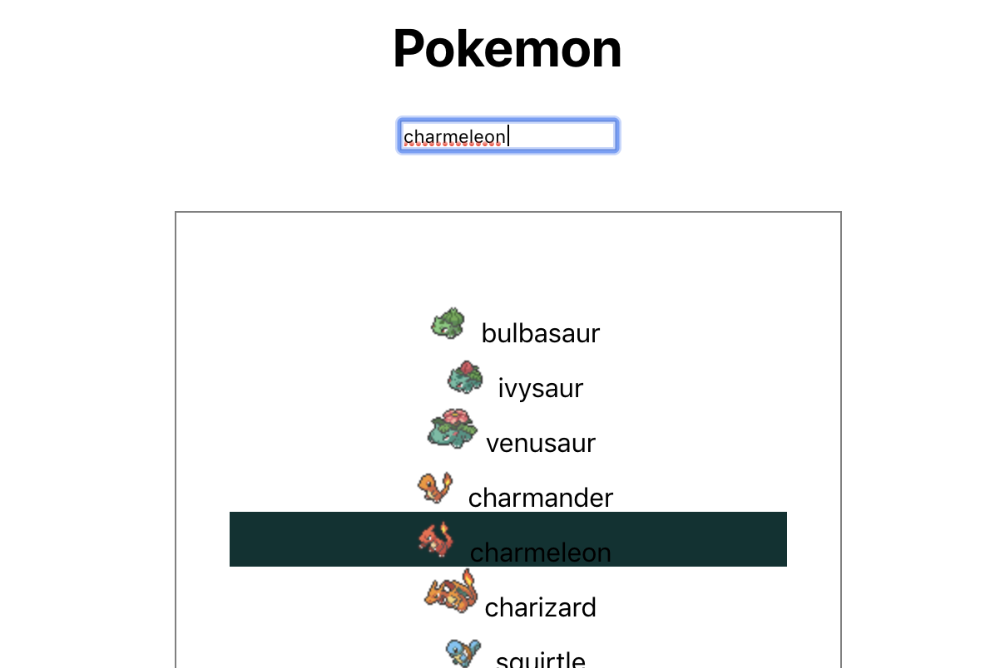

# Meet useState

As we said props in React is immutable, it won't change after rerender. You may wondering how to make your web application able to interact with user.

Let's do some experiment. We will create a `Example` component and have a `<button>` if user click `<button>`, the `count` value value displayed in screen will increase.

```jsx
function Example() {
  const count = 0;
  return (
    <div>
      <p>You clicked {count} times</p>
      <button
        onClick={() => {
          count++;
        }}
      >
        Click me
      </button>
    </div>
  );
}
```

You will see nothing change after you click. Why? You can also try debug by adding `console.log` in your onClick function, it's also called. After you spend sometime your may find that the value on JavaScript is already updated. But it's not update the display in HTML side.

_What happened?_

## How React rendering

Let's start with understand React rendering process. Each React application begins with a root component. So you can think of your application as a "tree" of component, and each point of time, component only recieve props and state to produce 1 version of UI. The first render, React will start execute your root component, and recursive through whole tree to get whole rendering element tree.


So at some point of time, user start to interact with your application, Your component may want to update your data according to user interaction.

In React, we called it `state`. Each component can have thier own state, and they can trigger metod to update it, this method is called `setState`. `setState` is React method provide by React, internally it will update the `state` value store in that component and also trigger rerender start from that component and recursive through all its children.


And React will update the Component tree to DOM tree in HTML.


## How to use React `state`

React has provided `state`, `setState` through a method called `useState`, `useState` declares a “state variable”. This is a way to "preserve" some values between the function calls

```jsx
import React, { useState } from "react";

function Example() {
  const [count, setCount] = useState(0);
  return (
    <div>
      <p>You clicked {count} times</p>
      <button onClick={() => setCount(count + 1)}>Click me</button>
    </div>
  );
}
```

`useState` is recieved 1 argument as a default value of state variables, and return 2 values as `array`. The first value is current state value and the next value is a function to set the state value.

So for this example above, when this component is rendered for the first time. The value of `count` will be 0 as we specify in `useState(0)`, if we not specify the value will be `undefined`. And to update state we will use `onClick` method which is a callback function when `<button>` is clicked to call `setCount` with `count + 1`. This will increasing `count` everytime user clicked. React will also rerender your component, so you can see your count value updating in your screen evertime you clicked as well.

Let's started with make our items inside state first

```diff
- import React from 'react'
+ import React, useState from 'react'

 function App() {
-  const items = [
+  const [pokemons] = useState([
    {
      name: "bulbasaur",
      url: "https://pokeapi.co/api/v2/pokemon/1/"
    },
    {
      name: "ivysaur",
      url: "https://pokeapi.co/api/v2/pokemon/2/"
    },
    {
      name: "venusaur",
      url: "https://pokeapi.co/api/v2/pokemon/3/"
      ...
    {
      name: "blastoise",
      url: "https://pokeapi.co/api/v2/pokemon/9/"
    },
    {
      name: "caterpie",
      url: "https://pokeapi.co/api/v2/pokemon/10/"
    }
+  ])
```

Then we will add the searchbar to search a pokemon detail by its name

```diff
- import React from "react";
+ import React, { useState } from "react";

function Header() {
+ const [value, setValue] = useState("");
  return (
    <div>
      <h1>My Header</h1>
+     <input value={value} onChange={e => setValue(e.target.value)} />
    </div>
  );
}
```

with this, you can try type in the input box. You will see the text is change. You can also try set only `value` without set `onChange`. You typed won't update the UI because React is not trigger re-render to update UI.

But we want to make our `List` able to interact with the input value we type here, like, if value that typed in List is same as pokemon name in `ListItem`. We will highlight the `ListItem`.

You may wondering, is there is way to sent the state from children to Parent component?

Nope, there is no way to do that in React. Because the data is only passed top-down (parent to child) via props or your component is defined your own data using state.



So let's said you want to make parent or siblings like `List` need to use that state from `Footer`. The way to do it in React is to move state in `Footer` into the Parent Component, `App` and now you can pass your state as props into both `List` and `Footer`.



So let's move our `value` state into `App`, and rename it to `pokemon`. But for make your `<input>` able to update state in `App`, you also need to pass down the `setValue` function as well and we will rename it to `setPokemon`.

```diff
 function App() {
+  const [pokemon, setPokemon] = useState('')
   const [pokemons] = useState([

   return (
     <div className="App">
-      <Header />
+      <Header pokemon={pokemon} setPokemon{setPokemon} />
       <List items={items} />
     </div>
   )
 }
```

Inside your `Header` component will receive props `pokemon` and `setPokemon` instead of use from `useState`

```diff
function Header({ pokemon, setPokemon }) {
- const [value, setValue] = useState("");
  return (
    <div>
      <h1>My Header</h1>
-     <input value={value} onChange={e => setValue(e.target.value)} />
+     <input value={pokemon} onChange={e => setPokemon(e.target.value)} />
    </div>
  );
}
```

## Two way binding

You may notice to be able to make children component update the state of parent component, parent may need to pass 2 value into props to children component (state variable and setState function). _This concept is called 2 way binding_.

But if your state provider and state consumer is really far away. You still need to passing these 2 props into all the component in between even the component is not using these value at all.


Also you may end-up writing a many line of code just to list down all props passing the component

## Meet Context API

React provides a way to share values like these between components without having to explicitly pass a prop through every level of the tree, called _Context_.

Context is designed to share data that can be considered “global” for a tree of React components which any children under the tree can be use.

To use context, we will call method in `React`, `createContext` to create the context object.

```jsx
const MyContext = React.createContext(defaultValue);
```

`React.createContext` will return a object of 2 value `Provider` and `Consumer`.

`Provider` is a React component that allows consuming components to subscribe to context changes. You may put `Provider` into your root component.

```jsx
function App() {
  ...
  return (
    <MyContext.Provider value={value}>
      <div>...</div>
    </MyContext.Provider>
  );
}
```

`Consumer`. To consume the value in the context. There is two way to do it. But today, we will use a function called `useContext` alias under `React`. To use it, you need to pass context object into `useContext`.

```jsx
import React, { createContext, useContext } from "react";

const MyContext = createContext({ state: "Hello context!!!" });

const { state } = useContext(MyContext);
// state = "Hello context!!!"
```

Let's update our Pokedex application to useContext, we will start with create a file called `PokemonContext.js` under `src/`. Then `createContext` and export the context object as default.

```jsx
import { createContext } from "react";

const PokemonContext = createContext("");

export default PokemonContext;
```

So in `App.js`, we will add the `Provider` into the root of element.

```diff
+ import PokemonContext from "./PokemonContext";

function App() {
  ...
  return (
+    <PokemonContext.Provider value={{ pokemon, setPokemon }}>
       <div className="App">
         <Header />
         ...
+    </PokemonContext.Provider>
  );
```

Then in your ListItem, you can start to consume these value. We will make ListItem highlighed by setting `backgroundColor` to `#033333`. We will also add `onClick` to update pokemon value when use click on the ListItem, and will clear pokemon value if use lick on ListItem that already highlight.

```diff
-import React from "react";
+import React, { useContext } from "react";

function ListItem({ name }) {
+  const { pokemon, setPokemon } = useContext(
+    PokemonContext
+  );

   return (
     <li
       style={{
         listStyle: "none",
+        backgroundColor: pokemon !== name ? "#ffffff" : "#033333"
       }}
+      onClick={() =>
+        pokemon !== name
+          ? setPokemon(name)
+          : setPokemon(null)
+      }
    >
      
      <span>{name}</span>
    </li>
  );
```

## Final result



### Reference

- https://www.freecodecamp.org/news/how-to-identify-and-resolve-wasted-renders-in-react-cc4b1e910d10/
- https://reactjs.org/docs/context.html
