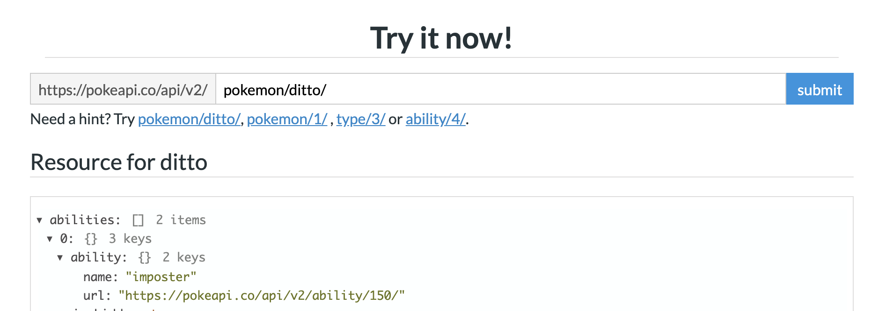

# Fetch Pokemon detail

## React component Life cycle

So after we know how React structure thier component tree and render there component into element one by one. There are 2 more word in React.

The first word is `mounted`. Mounted mean the first time your component in render. Why this step is so important? Because this step, React need to call `document.createElement` to create real component on HTML side.

Then every re-render that it will just update props and update DOM. This is called `updated`.

Then if parent component trigger re-render and decide to not render your component. This won't just dispose your component. React will call method to unmount your component. This is called `unmounted`.

React also provided you a way to hooks after mounted, updated and unmount using `useEffect`

```jsx
function App() {
  const [count, setCount] = useState(0);
  useEffect(() => {
    document.title = `Count ${count}`;
  });

  return (
    <div>
      <button onClick={() => setCount(count + 1)} />
    </div>
  );
}
```

The callback function you passing in to `useEffect` will called everytime **after** component render. This function is really helpful when writing React application. Because with this, you are able to inject some logic along with React Component lifecycle, and not slow down the rendering process.

We usually do asynchonous or complex task inside `useEffect`. And when it done we will tell React to update UI by calling `setState`.

```diff
 function App() {
   const [count, setCount] = useState(0);
+  useEffect(() => {
+    setInterval(() => {
+      setCount(count => count + 1)
+    }, 1000)
+  }, []);
   useEffect(() => {
     document.title = `Count ${count}`;
   });

   return (
     <div>
```

But if you call `setInterval` with out `clearInterval`, your application will end up having memory leak problem. But when should you called it. No worry, `useEffect` also provide you a way to do it. By returning a callback function to clear all your pending function or memory. You function will trigger when Component is unmounted

```diff
 function App() {
   const [count, setCount] = useState(0);
   useEffect(() => {
-    setInterval(() => {
+    const interval = setInterval(() => {
       setCount(count => count + 1)
     }, 1000)
+    return () => {
+      clearInterval(interval)
+    }
   });
   useEffect(() => {
```

With useEffect by default your callback function will be called everytime your component re-render, to but usually you don't want to call your function everytime. This is when the last use last argument of `useEffect` come to scene. Last argument of `useEffect` is to decide when to trigger, it will trigger callback only if any value in the list is changed.

```js
useEffect(callback, [dependency]);
```

```jsx
useEffect(() => {
  setInterval(() => {
    setCount(count => count + 1);
  }, 1000);
}, [count]);
```

## Fetch

One common usage of `useEffect` is to fetch data, because we only want to fetch data only for the first time or when something is changed. Actually you can do fetch before rendered but it's better to fetch after so user can see UI first then you can do some calculation logic.

We will also use `useEffect` to fetch pokemon detail in our app. But before go further let's take a quick peek on how to use Fetch API.

[Fetch API](https://developer.mozilla.org/en-US/docs/Web/API/Fetch_API) provides an interface for fetching resources (including across the network). To use it, you call `fetch` with `url` and it will return Promise after request is resolve.

```js
fetch("url to fetch")
  .then(function(response) {
    if (response.status !== 200) {
      console.log(
        "Looks like there was a problem. Status Code: " + response.status
      );
      return;
    }

    response.json().then(function(data) {
      console.log(data);
    });
  })
  .catch(function(err) {
    console.log("Fetch Error :-S", err);
  });
```

So again let's use our https://pokeapi.co/ again. To fetch the pokemon detail, we just need to the name and append it to url `/pokemon` like `https://pokeapi.co/api/v2/pokemon/ditto`



Let's create a new Pokemon component in `./Pokemon.js`. simply start with writing `fetchPokemon` function which will call fetch of pokemon infomation by name. And return the fetch result into JavaScript object.

```jsx
const fetchPokemon = async name => {
  const response = await fetch(`https://pokeapi.co/api/v2/pokemon/${name}`);
  const pokemon = await response.json();
  return pokemon;
};
```

Then let's try it out. By straightforward called this method with some pokemon name 'ditto' and console log it out.

```jsx
fetchPokemon("ditto").then(() => {
  console.log(pokemon);
});
```

Okay look like it work! What you need to need to do now is create a `Pokemon` component and put our fetchPokemon in `useEffect` to trigger fetch everytime `name` is changed. And instead of `console.log(pokemon)` you just need to set it into state so after fetch result is coming, React will re-render and show your pokemon detail on screen.

```jsx
import React, { useState, useEffect } from "react";

export default function Pokemon({ name }) {
  const [pokemon, setPokemon] = useState();
  useEffect(() => {
    const fetchPokemon = async () => {
      const response = await fetch(`https://pokeapi.co/api/v2/pokemon/${name}`);
      const pokemon = await response.json();
      setPokemon(pokemon);
    };

    fetchPokemon();
  }, [name]);

  return (
    <div
      style={{
        display: "flex",
        flexDirection: "column",
        alignItems: "center"
      }}
    >
      <div>
        <div>{pokemon ? pokemon.name : ""}</div>
        <div>
          {pokemon && pokemon.types
            ? pokemon.types.map(({ type: { name } }, index) => (
                <button type="button">{name}</button>
              ))
            : null}
        </div>
      </div>
    </div>
  );
}
```

Then in `App.js`, we will render `Pokemon` and passing `pokemon` value as a `name` props.

```diff
+ import Pokemon from './components/Pokemon';

 function App() {);
   const [pokemon, setPokemon] = useState('')
   ...

   return (
     <PokemonContext.Provider value={{ selectedPokemon, setSelectedPokemon }}>
       <div className="App">
         ...
+        <div
+          style={{
+            width: 335,
+            height: 505,
+            padding: 32,
+            border: "1px solid grey"
+          }}
+        >
+          <Pokemon name={pokemon} />
+        </div>
       </div>
     </PokemonContext.Provider>
   )
```

To complete pokemon page, we will add the pokemon sprite. We will use data from https://github.com/PokeAPI/sprites/tree/master/sprites/pokemon.

```diff
export default function Pokemon({ name }) {
  ...
+  const image = `https://github.com/PokeAPI/sprites/raw/master/sprites/pokemon/${
+    pokemon ? pokemon.id : 0
+  }.png`;
  return (
    <div
      style={{
        display: "flex",
        flexDirection: "column",
        alignItems: "center"
      }}
    >
+      <div>
+        <div>
+          
+        </div>
+      </div>
      <div>
        <div>{pokemon ? pokemon.name : ""}</div>
```

Next thing, we will change our pokemon list which we manually copy from api response into fetch the pokemons list with a load more button.

One more powerful feature of react hooks is ability to group all your hooks (useState, useEffect e.g.) logic into one function.

```jsx
function useFetchPokemons() {
  const [offset, setOffset] = useState(0);
  const [pokemons, setPokemons] = useState([]);
  const [loading, setLoading] = useState(true);

  useEffect(() => {
    const fetchPokemons = async () => {
      const response = await fetch(
        `https://pokeapi.co/api/v2/pokemon/?offset=${offset}&limit=10`
      );
      const { results } = await response.json();
      const newPokemons = results.map(pokemon => pokemon);
      setPokemons(oldPokemons => oldPokemons.concat(newPokemons));
      setLoading(false);
    };

    fetchPokemons();
  }, [offset]);
  return [pokemons, loading];
}
```

So when you use it, user no need to care about `setState` or data handling, our method will internally do fetch itself. Also your `useFetchPokemons` now can reuse with other people. This is what best that the new react hooks give you.

```diff
function App() {
+  const [pokemons, loading] = useFetchPokemons();
  return (
     <PokemonContext.Provider value={{ selectedPokemon, setSelectedPokemon }}>
       <div className="App">
        ...
+       <List items={pokemons} loading={loading} />
```

```diff
- function List({ items }) {
+ function List({ items, loading }) {
    return (
      <ul style={{ padding: 0 }}>
        {items.map(item => (
          <ListItem {...item} />
        ))}
+       {loading ? (
+         "Loading..."
+       ) : (
+         <button}>Load more...</button>
+       )}
      </ul>
    )
}
```

## Load more

To implement loadMore function with react hook is really easy, your `loadMore` is just a function that increase the `offset` by `limit` and after that React will update value and trigger your `fetchPokemons` again with new offsets.

```diff
  function useFetchPokemons() {
    const [offset, setOffset] = useState(0);
    const [pokemons, setPokemons] = useState([]);
    const [loading, setLoading] = useState(true);
      ...
      fetchPokemon();
    }, [offset]);

+  const loadMore = (limit = 10) => {
+    setOffset(offset + limit);
+  };
-  return [pokemons, loading];
+  return [pokemons, loading, loadMore];
}
```

```diff
function App() {
+   const [pokemons, loading, loadMore] = useFetchPokemons();
    return (
      <PokemonContext.Provider value={{ selectedPokemon, setSelectedPokemon }}>
        <div className="App">
          ...
-        <List items={pokemons} loading={loading} />
+        <List items={pokemons} loading={loading} loadMore={loadMore} />
```

```diff
- function List({ items, loading }) {
+ function List({ items, loading, loadMore }) {
    return (
      <ul style={{ padding: 0 }}>
        {items.map(item => (
          <ListItem {...item} />
        ))}
         {loading ? (
           "Loading..."
         ) : (
-          <button>Load more...</button>
+          <button onClick={loadMore}>Load more...</button>
       )}
      </ul>
    )
}
```

## useCallback

TODO:
