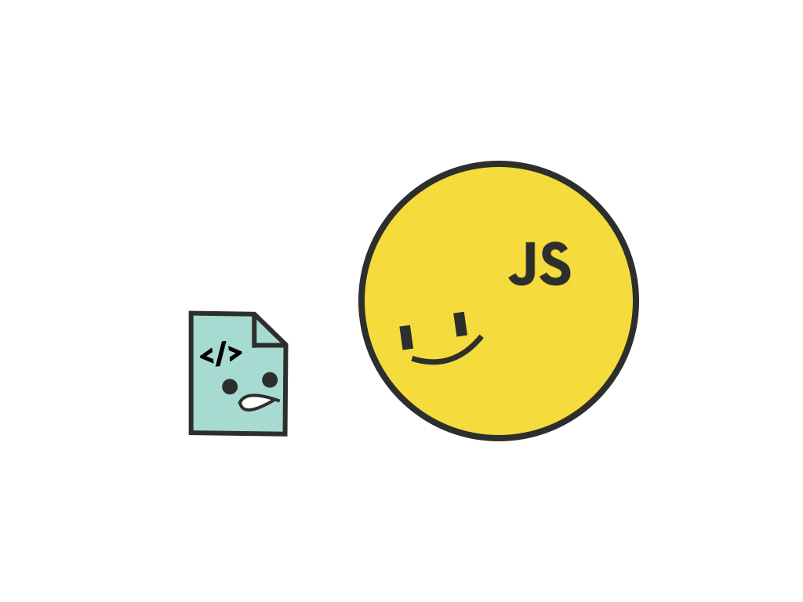
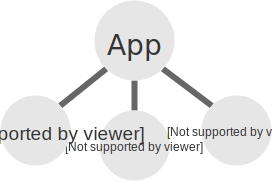
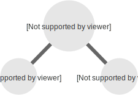
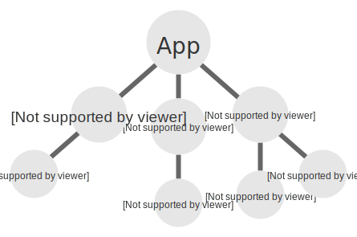
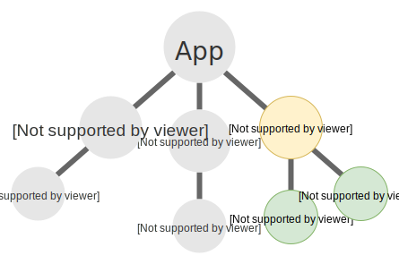
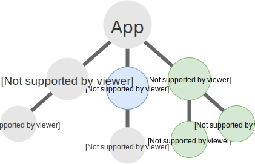
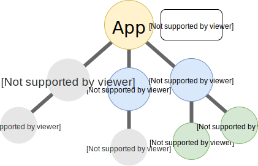
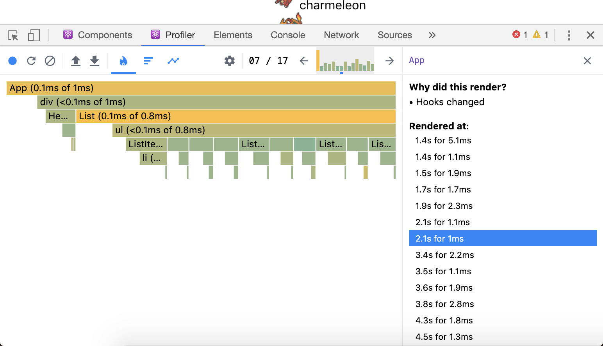

import "./style.css";

import { Appear, Head, Notes, Image } from "mdx-deck";
import { Split } from "mdx-deck/layouts";
import { CodeSurferLayout } from "code-surfer";
import WireframeWebsite from "./components/WireframeWebsite";
import {
  MainLayout,
  DefaultLayout,
} from "./components/Layout";
import HtmlTitle from "./components/HTML";
import Terminal from "./components/Terminal";
import UserCard from "./components/UserCard";
import EmbeddingExpJSX from "./components/EmbeddingExpJSX";

export { themes } from "./theme";

<Head>
  <title>Introduction to React</title>
</Head>

<MainLayout>

# Introduction to React

## @nutstick

</MainLayout>

---

<MainLayout>

# Web development

</MainLayout>

---

<WireframeWebsite />

<div style={{ height: "1em" }} />

<div
  style={{
    display: "flex",
    flexDirection: "column",
    justifyContent: "center",
    alignItems: "center",
    width: "100%",
    fontSize: "2rem",
  }}
>
  <HtmlTitle />
</div>

<Notes>

- 1 page is big template string of html

</Notes>

---

<Image src="static/images/www.png" />

<Notes>

- First website
- Website is create purpose for showing content like a book

</Notes>

---

<WireframeWebsite />

<div style={{ height: "1em" }} />

<Appear>
  <li>CSS</li>
  <li>JavaScript</li>
</Appear>

<Notes>

- css purpose is too style your html
- global for whole page
- javascript purpose to add logic into html

</Notes>

---

<MainLayout>

## JavaScript

</MainLayout>

---

# [Web APIs](https://developer.mozilla.org/en-US/docs/Web/API)

- [Document Object Model (DOM)](https://developer.mozilla.org/en-US/docs/Web/API/Document_Object_Model)
- [Fetch](https://developer.mozilla.org/en-US/docs/Web/API/Fetch_API)

<Notes>

- with DOM, JavaScript can manipulate the content in HTML and style

- JavaScript is really powerful

- connect Data, logic and HTML together

</Notes>

---

<MainLayout>

## 💪 💪 💪 💪

</MainLayout>

---



📄 Super big JavaScript file

<Notes>

- JavaScript file is become bigger and bigger. And be a core of web application development

</Notes>

---

# Take a deep breath

---

<CodeSurferLayout>

```jsx
User lists page
```

```jsx
<div class="main">
  <div class="person" on-click="javascript()">
    
    <span class="name">Hosea Dickinson</span>
  </div>
  <div class="person" on-click="javascript()">
    
    <span class="name">Anabel Welch</span>
  </div>
  <div class="person" on-click="javascript()">
    
    <span class="name">Miss Ernesto Medhurst</span>
  </div>
  <div class="person" on-click="javascript()">
    
    <span class="name">Elody Herman</span>
  </div>
</div>
```

```jsx 2:8
<div class="main">
  <div class="person" on-click="javascript()">
    
    <span class="name">Hosea Dickinson</span>
  </div>
  <div class="person" on-click="javascript()">
    
    <span class="name">Anabel Welch</span>
  </div>
  <div class="person" on-click="javascript()">
    
    <span class="name">Miss Ernesto Medhurst</span>
  </div>
  <div class="person" on-click="javascript()">
    
    <span class="name">Elody Herman</span>
  </div>
</div>
```

```jsx 9:15
<div class="main">
  <div class="person" on-click="javascript()">
    
    <span class="name">Hosea Dickinson</span>
  </div>
  <div class="person" on-click="javascript()">
    
    <span class="name">Anabel Welch</span>
  </div>
  <div class="person" on-click="javascript()">
    
    <span class="name">Miss Ernesto Medhurst</span>
  </div>
  <div class="person" on-click="javascript()">
    
    <span class="name">Elody Herman</span>
  </div>
</div>
```

```jsx 15:21
<div class="main">
  <div class="person" on-click="javascript()">
    
    <span class="name">Hosea Dickinson</span>
  </div>
  <div class="person" on-click="javascript()">
    
    <span class="name">Anabel Welch</span>
  </div>
  <div class="person" on-click="javascript()">
    
    <span class="name">Miss Ernesto Medhurst</span>
  </div>
  <div class="person" on-click="javascript()">
    
    <span class="name">Elody Herman</span>
  </div>
</div>
```

```jsx 1:9
<div class="person" on-click="javascript()">
  
  <span class="name">Miss Ernesto Medhurst</span>
</div>
```

```jsx 1:6
<div class="person" on-click="javascript()">
  
  <span class="name">::__name__::</span>
</div>
```

```jsx
var avatar = "https://s3.amazonaws.com/uifaces/faces/twitter/kaelifa/128.jpg";
var name = "Miss Ernesto Medhurst";
var template = "
  <div class="person" on-click="javascript()">
    
    <span class="name">
      ::__name__::
    </span>
  </div>
";
document.appendChild(template.replace("::__avatar__::", name).replace("::__name__::", template))
```

</CodeSurferLayout>

---

<MainLayout>

<h1 style={{ marginBottom: 0 }}>Data</h1>

<div>+</div>

```html
<div class="person" on-click="javascript()">
  
  <span class="name">
    ::__name__::
  </span>
</div>
```

<UserCard />

</MainLayout>

---

<MainLayout>

# Component

</MainLayout>

---

## Separate concern

---

## Reusable

---

<MainLayout>

<Image
  src="static/images/logo.svg"
  style={{ width: 300, height: 300 }}
/>

<h1 style={{ marginTop: '0em' }}>
React
</h1>

</MainLayout>

---

```jsx
var template = "
  <div class="person" on-click="javascript()">
    
    <span class="name">
      ::__name__::
    </span>
  </div>
";
document.appendChild(
  template
    .replace("::__avatar__::", name)
    .replace("::__name__::", template)
)
```

## Template is a string

<Notes>
  
- Template is a string
- Structure can't change or hard to change
- create new component for new structure
- We want more dynamic template

</Notes>

---

```js
React.createElement("div", {
  className: "person",
  children: [
    React.createElement("img", {
      className: "avatar",
      src: avatar,
    }),
    React.createElement("span", {
      className: "name",
      children: name,
    }),
  ],
});
```

<Notes>

- JavaScript object

- internally react comsume those element object and convert into html

</Notes>

---

<MainLayout>

## JSX 🎉🎉🎉

```jsx
const name = "Josh Perez";
const element = <h1>Hello, {name}</h1>;

ReactDOM.render(element, document.getElementById("root"));
```

</MainLayout>

---

<MainLayout>

> React creating base one design implement that component base

</MainLayout>

---

<MainLayout>

<CodeSurferLayout>

```
UI = render(Data)
```

```
UI = render(Props, State)
```

</CodeSurferLayout>

</MainLayout>

<Notes>

- A component received "Data" and use to render "UI"

</Notes>

---

# Component

App 

Footer 

---

<MainLayout>

<h3 className="primary">Application = Tree of Components</h3>



</MainLayout>

---

## 🤫

### Dynamic template is slow

---

## Optimization

---

## VirtualDOM

---

<a href="https://quizzical-khorana-a9f023.netlify.com/">
  <Image
    style={{
      maxWidth: "80%",
      maxHeight: "80%",
      margin: "0 auto",
    }}
    src="static/images/screenshot.png"
    alt="static/images/screenshot.png"
  />
</a>

---

<MainLayout>

# Getting Started!!

</MainLayout>

---

<Terminal>
  {`npx create-react-app my-app\n# or\nnpm install -g create-react-app\ncreate-react-app my-app`}
</Terminal>

---

<MainLayout>

# [Create react app](https://github.com/facebook/create-react-app)

> Official starter kit for React.

</MainLayout>

---

<CodeSurferLayout>

```shell
my-app
├── README.md
├── node_modules
├── package.json
├── .gitignore
├── public
│   ├── favicon.ico
│   ├── index.html
│   └── manifest.json
└── src
    ├── App.css
    ├── App.js
    ├── App.test.js
    ├── index.css
    ├── index.js
    ├── logo.svg
    └── serviceWorker.js
```

```shell 12
my-app
├── README.md
├── node_modules
├── package.json
├── .gitignore
├── public
│   ├── favicon.ico
│   ├── index.html
│   └── manifest.json
└── src
    ├── App.css
    ├── App.js
    ├── App.test.js
    ├── index.css
    ├── index.js
    ├── logo.svg
    └── serviceWorker.js
```

</CodeSurferLayout>

---

<MainLayout>

# ⚛️ React component

</MainLayout>

---

# JSX

#### JSX is a syntax extension to JavaScript

---

## JavaScript to manipulate DOM

---

```js
var heading = document.createElement("h1");
var heading_text = document.createTextNode("Hello world!!");

heading.appendChild(heading_text);

document.body.appendChild(heading);
```

---

```jsx
import { render } from "react-dom";
const element = <h1>Hello, world!</h1>;

render(element, document.body);
```

---

```jsx
const element = <h1>Hello, world!</h1>;
```

JSX is neither a string nor HTML.

---

<MainLayout>
  <EmbeddingExpJSX />
</MainLayout>

---

## ⚠️ IMPORTANT NOTE!!

React element is immutable, after you called `render`. They won't change anymore until you `render` again.

---

### Passing html attribute

```jsx
const element = (
  <div className="my-div" tabIndex="0">
    Hello
  </div>
);
```

<Notes>

Since JSX is closer to JavaScript than to HTML, React DOM uses camelCase property naming convention instead of HTML attribute names. For examples,

</Notes>

---

## kebab vs camelCase

- `class -> className`
- `tab-index -> tabIndex`
- `min-height -> minHeight`

---

### Passing function directly 👍

```jsx
function onChange() {
  console.log("changed!!");
}

const element = (
  <select onChange={onChange}>
    <option>Yes</option>
    <option>No</option>
  </select>
);
```

---

### Children

```jsx
const element = <h1>React</h1>;
# or
const element = <h1 children="React" />;
```

<Notes>

- nested element or expression under tag with becomes `children`. So you can do

</Notes>

---

<CodeSurferLayout>

```jsx
const element = (
  <div>
    <h1>Hello world!!</h1>
  </div>
);
```

```jsx
const element = React.createElement("div", {
  children: React.createElement("h1", {
    children: "Hello world!!",
  }),
});
```

</CodeSurferLayout>

---

## Other Rules

---

```html
/* Bad */
<h1>2</div>
<div>
  
</div>
/* Good */
<h1>2</h1>
<div>
  
</div>
```

---

```jsx
const element2 = (
  <div>
    <h1>I am a Header.</h1>
    <h1>I am a Header too.</h1>
  </div>
);
```

---

```jsx
/* Bad */
const element = (
  <h1>I am a Header.</h1>
  <h1>I am a Header too.</h1>
)
/* Good */
const element2 = (
  <div>
    <h1>I am a Header.</h1>
    <h1>I am a Header too.</h1>
  </div>
)
```

---

## React Component and Props

---

<Image
  style={{
    maxWidth: "80%",
    maxHeight: "80%",
    margin: "0 auto",
  }}
  src="static/images/screenshot.png"
  alt="static/images/screenshot.png"
/>

<Notes>

- We will make the pokemon list on this left side first

</Notes>

---

### Function component

```jsx
function List(props) {
  return (
    <ul>
      <li>item 1</li>
      <li>item 2</li>
      <li>item 3</li>
    </ul>
  );
}
```

---

`<List />`

```jsx
React.createElement(List, {
  ...props,
});
```

---

### Passing props

---

## Props

props are used to pass information from component to component

---

```jsx
<MyComponent
  name="Liaison"
  age={26}
  others={{
    weight: 42,
    height: 175,
  }}
/>;

function MyComponent(props) {
  /*
    props = {
      name: "Liaison",
      age: 26,
      other: {
        weight: 42,
        height: 175
      },
    }
  */
  console.log(props);
  return <div>MyComponent</div>;
}
```

---

## Start Coding

---

```jsx
import React from "react";

function Header() {
  return <h1>My Header</h1>;
}

export default Header;
```

---

```jsx
import React from "react";

export default function List({ items }) {
  return (
    <ul>
      {items.map(item => (
        <li>{item.children}</li>
      ))}
    </ul>
  );
}
```

---

```jsx
import React from "react";

export default function ListItem({ children }) {
  return <li>{children}</li>;
}
```

```jsx
import React from "react";
import ListItem from "./ListItem";

export default function List({ items }) {
  return (
    <ul>
      {items.map(item => (
        <ListItem {...item} />
      ))}
    </ul>
  );
}
```

---

<MainLayout>

# [PokeAPI](https://pokeapi.co/)

```
pokemon?limit=10&offset=0
```

</MainLayout>

---


```
const sprite = `https://img.pokemondb.net/sprites/sun-moon/icon/{name}.png`;
```

---

# State

---

<Image
  style={{
    maxWidth: "80%",
    maxHeight: "80%",
    margin: "0 auto",
  }}
  src="static/images/screenshot.png"
  alt="static/images/screenshot.png"
/>

---

```jsx
import React, { useState } from "react";

function Example() {
  let count = 0;
  return (
    <div>
      <p>You clicked {count} times</p>
      <button onClick={() => count++}>Click me</button>
    </div>
  );
}
```

---

## 🤔

---

# How React rendering

---


<Notes>

- Application is tree, component data => ui
- Data = Props, State
- Props not themself it passing from parent only
- State, your component can change

</Notes>

---



---


---

<MainLayout>

# useState

</MainLayout>

---

`useState` declares a “state variable”. This is a way to “preserve” some values between the function calls

---

```jsx
import React, { useState } from "react";

function Example() {
  const [count, setCount] = useState(0);
  return (
    <div>
      <p>You clicked {count} times</p>
      <button onClick={() => setCount(count)}>
        Click me
      </button>
    </div>
  );
}
```

---

# Let's use it!!!

---

```diff
- import React from "react";
+ import React, { useState } from "react";

function Header() {
+ const [value, setValue] = useState("");
  return (
    <div>
      <h1>My Header</h1>
+     <input value={value} onChange={e => setValue(e.target.value)} />
    </div>
  );
}
```

---



---



---


---

<MainLayout>

# Context

</MainLayout>

---

Context is a way share data that can be considered “global” for a tree of React components

---

```jsx
<Parent a={...}>
  <...>
    <...>
      <Children b={"I want to use a"}>
```

---

<MainLayout>

## Context API

#### Provider

```jsx
const MyContext = React.createContext(defaultValue);

function App() {
  ...
  return (
    <MyContext.Provider value={value}>
      <div>...</div>
    </MyContext.Provider>
  );
}
```

</MainLayout>

---

<MainLayout>

## Context API

#### Consumer

```jsx
import React, { createContext, useContext } from "react";

const MyContext = createContext({
  state: "Hello context!!!",
});

const { state } = useContext(MyContext);
// state = "Hello context!!!"
```

</MainLayout>

---

## Code more...

---

<MainLayout>

## React Component Life cycle

</MainLayout>

---

<Image
  src="static/images/ss-4-1.svg"
  width="842px"
  height="394px"
/>

---

Effect Hook

```js
useEffect(callback, [dependency]);
```

---

```jsx
function Example() {
  const [count, setCount] = useState(0);
  useEffect(() => {
    document.title = "Count " + count;
  });

  return (
    <div>
      <button onClick={() => setCount(count + 1)} />
    </div>
  );
}
```

---

```jsx
useEffect(() => {
  setInterval(() => {
    setCount(count => count + 1);
  }, 1000);
}, []);
```

---

<MainLayout>

# [Fetch API](https://developer.mozilla.org/en-US/docs/Web/API/Fetch_API)

</MainLayout>

---

<a href="https://pokeapi.co/api/v2/pokemon/ditto">
  <Image
    src="static/images/ss-4-2.png"
    alt="ditto"
    width="256px"
    height="256px"
  />
</a>

---

<Image
  style={{
    maxWidth: "80%",
    maxHeight: "80%",
    margin: "0 auto",
  }}
  src="static/images/screenshot.png"
  alt="static/images/screenshot.png"
/>

---

```js
const fetchPokemon = async name => {
  const response = await fetch(
    `https://pokeapi.co/api/v2/pokemon/${name}`
  );
  const pokemon = await response.json();
  return pokemon;
};
```

---

<MainLayout>

### `React.useEffect`

</MainLayout>

---

<MainLayout>

# Pokemon lists

</MainLayout>

---

<MainLayout>

# Combining hooks

</MainLayout>

---

```jsx
function useFetchPokemons() {
  ...

  return [pokemon, loading, loadMore]
}
```

---

<MainLayout>

# :zap:

</MainLayout>

---

<MainLayout>

# Unnecessary Rendering

</MainLayout>

---

# 🧰 React Devtools

---



---

<MainLayout>

## React.memo + useCallback

</MainLayout>

---

<MainLayout>

# Styles

</MainLayout>

---

<MainLayout>

# CSS

</MainLayout>

---

## CSS is global 🌎

---

# [CSS Modules](https://github.com/css-modules/css-modules)

---

> A CSS Module is a CSS file in which all class names and animation names are scoped locally by default.

---

```css
.screen {
  background: red;
}
```

```jsx
import s from "./style.module.css";

s = {
  screen: "Pokedex_screen__3NTsC",
};
```

---

## Put a style

---

# [NES.css](https://nostalgic-css.github.io/NES.css/)

---

<Image
  src="https://upload.wikimedia.org/wikipedia/commons/9/96/Sass_Logo_Color.svg"
  width="512px"
  height="384px"
/>

---

<Terminal>
  {`yarn add -D node-sass\n` +
    `# or\n` +
    `npm install --dev node-sass`}
</Terminal>

---

<MainLayout>

# 🔮

# Just a magic

</MainLayout>

---

# Image Assets

---

```jsx
import image from "./image.svg";

;
```

---


---

<MainLayout>

# Deploy 🚀

</MainLayout>

---

## build your app

<Terminal>{`yarn build`}</Terminal>

---

<MainLayout>

# [Netlify 🙏🙏](https://www.netlify.com/)

</MainLayout>

---

<Image
  style={{
    maxWidth: "80%",
    maxHeight: "80%",
    margin: "0 auto",
  }}
  src="static/images/screenshot.png"
  alt="static/images/screenshot.png"
/>

---

# Thanks!!!
